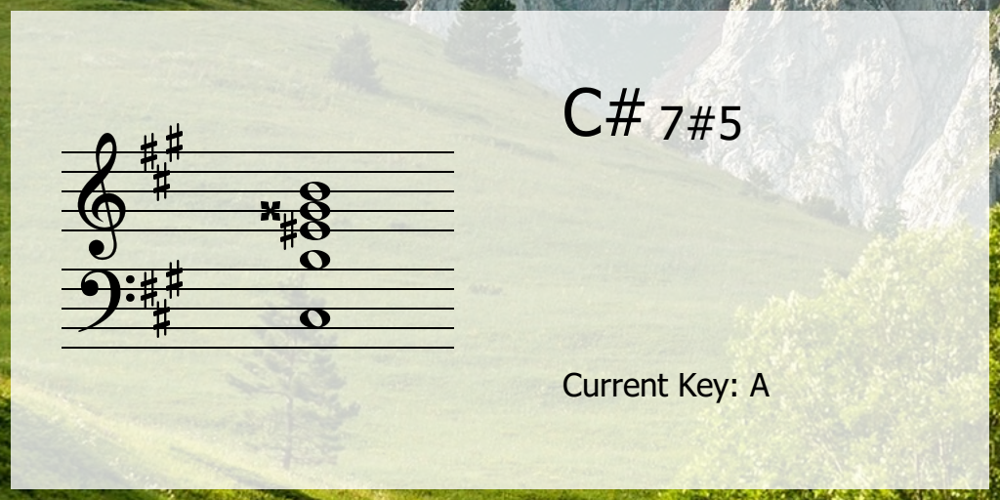

# JustChord
[](https://semver.org)

A real-time (Midi) visualization tool for chords with grand staff view.

Uses RtMidi for driver and PyQt for widgets 


## Features
- Chord Recognition
- Customize chord dictionary
- Auto Key detection
- Individual customizable widgets

## Installation

on Python 3.6-3.8, install `python-rtmidi` and `pyqt5`:

```bash
$ pip3 install -r requirements.txt
```

 Then launch it by:

```
$ python3 main.py
```

- Two widgets: staff and chords are on the left and right by default. Drag them to whereever you want.

- **Right click** on each widget for more options, color, font, midi device selection etc.

- Use mouse wheel to adjust window opacity. 

- The Chord dictionary is stored in `./core/constants.py`. You can add new entry by copy/paste an existing line.

## Current Development

I'm still trying to improve on details, and make this program's logical structure better to understand.

Please feel free to submit issues or make any comments. 

